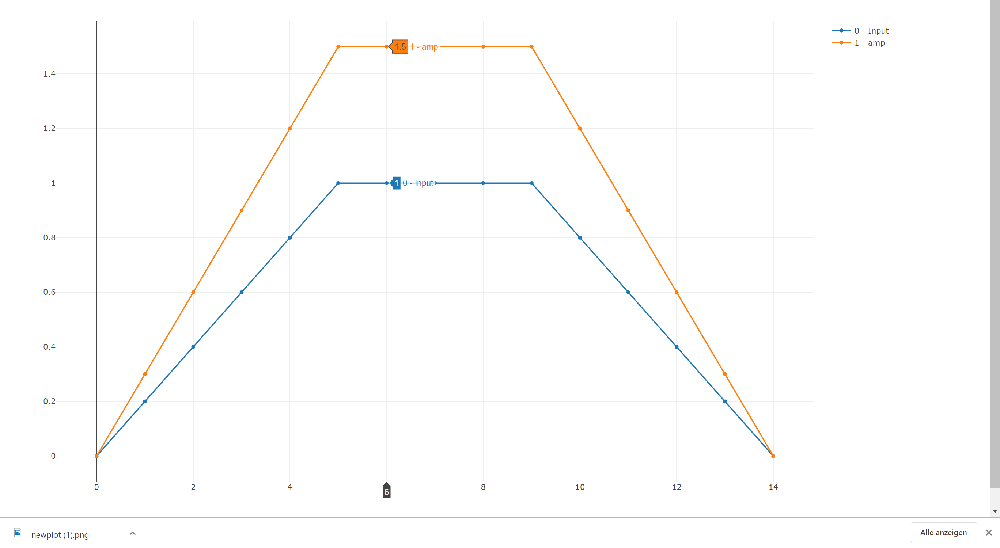
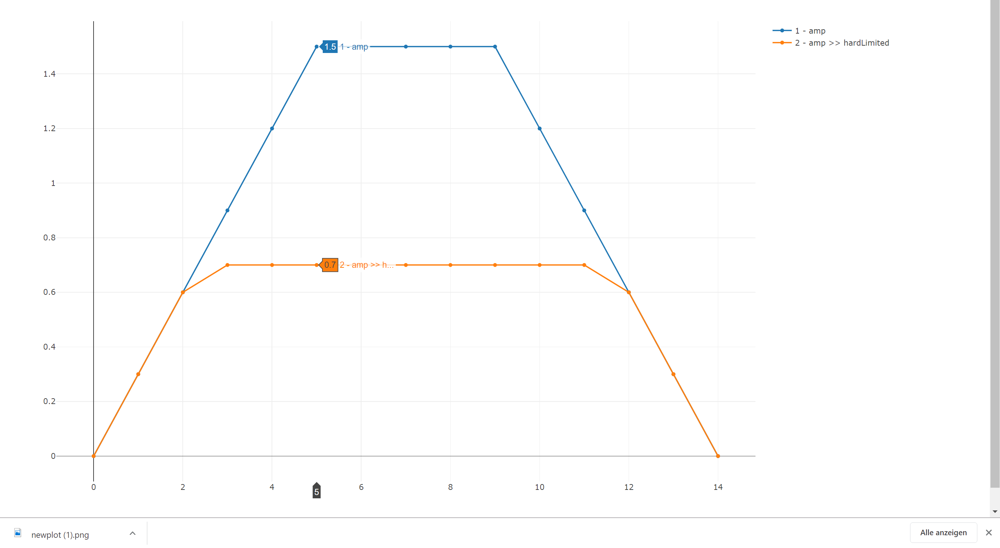
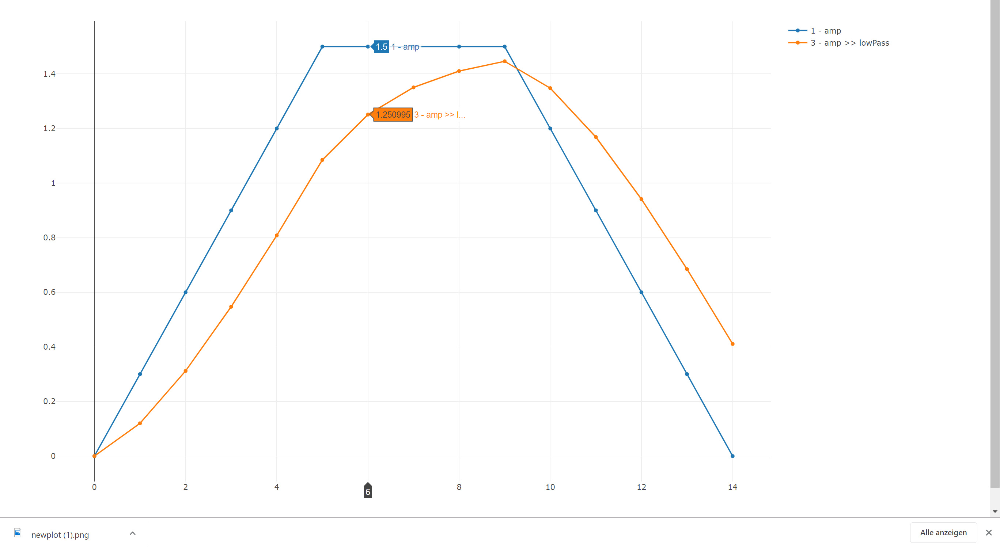
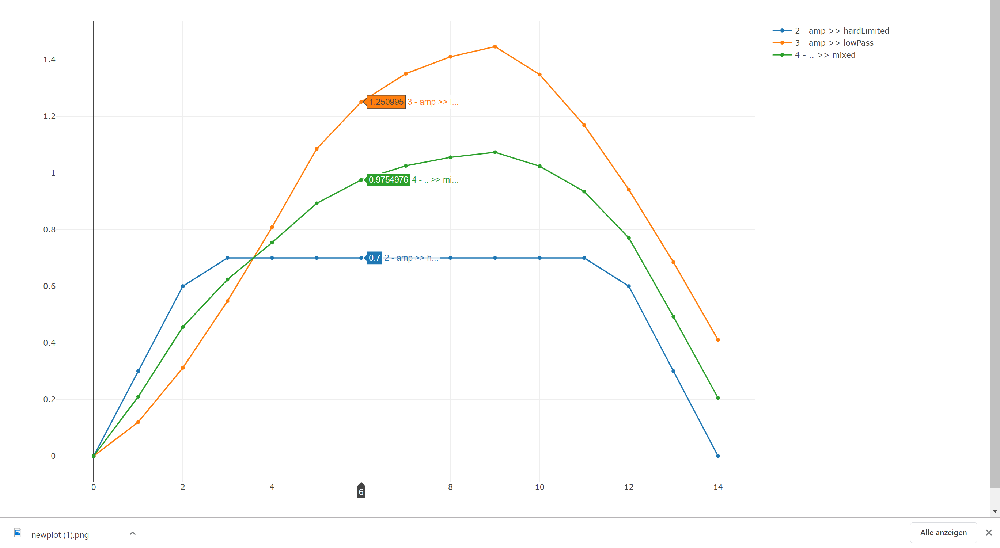
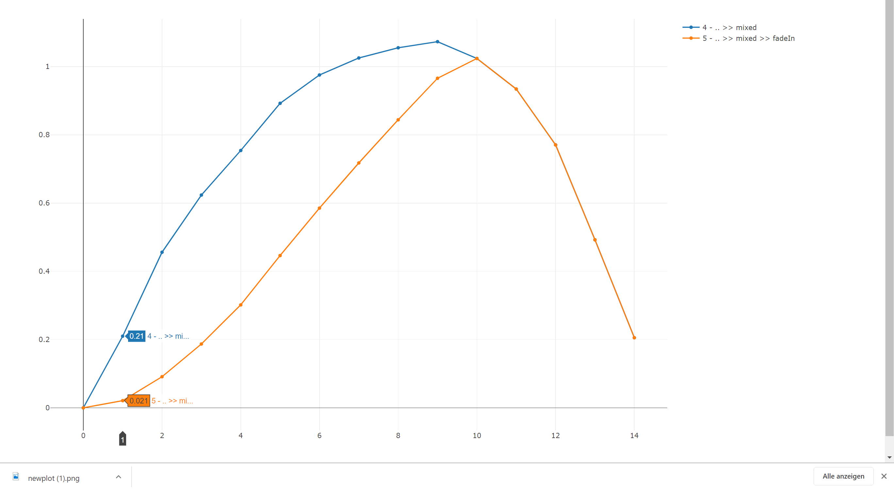
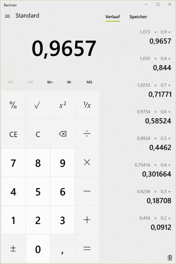
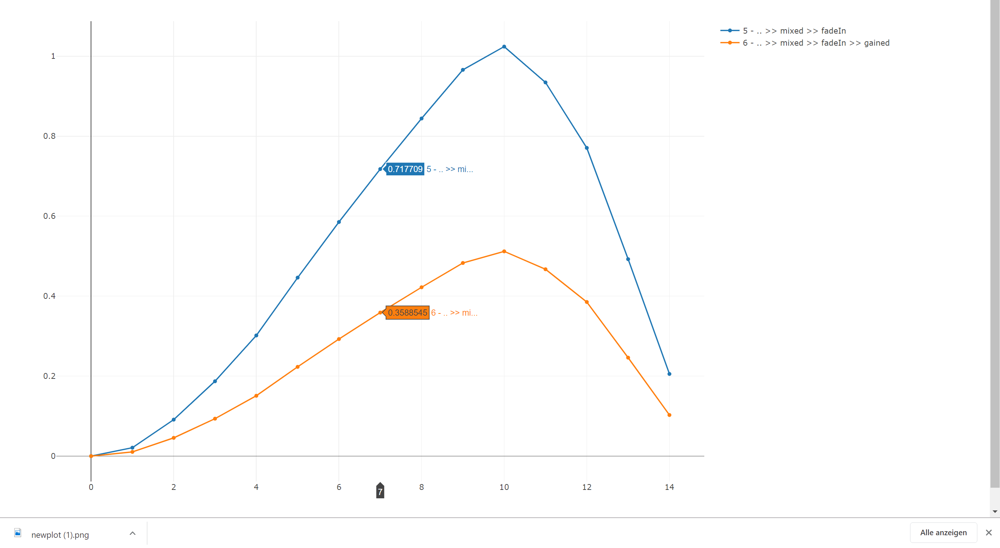
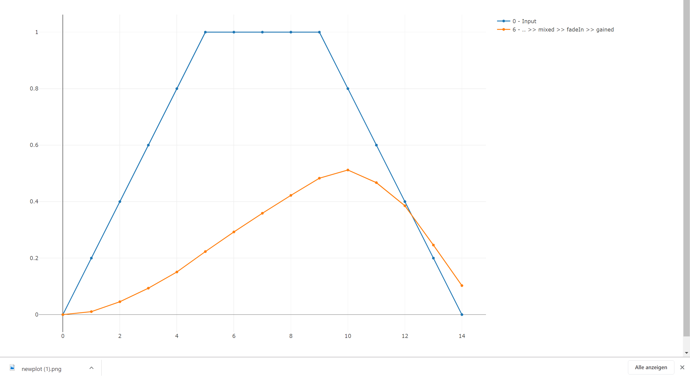

## Analysis

Now we can write blocks, understand the inner mechanism of composing them, and evaluate them. Time to have a closer look on our `blendedDistortion` use case. In the next chapter, we will dissect the parts of `blendedDistortion` step by step and retrace the flow of values through our computation.

Before we begin, the following samples use a constant set of parameters used in our computations:

```fsharp
let driveConstant = 1.5
let hardLimitConstant = 0.7
let lowPassConstant = 0.4
let mixABConstant = 0.5
let gainConstant = 0.5
let fadeInStepSize = 0.1
```

...and there are some helper functions for evaluating a `Block` against the same set of input values:

```fsharp
let inputValues = [ 0.0; 0.2; 0.4; 0.6; 0.8; 1.0; 1.0; 1.0; 1.0; 1.0; 0.8; 0.6; 0.4; 0.2; 0.0 ]
```

<hint>

Please take a look at the `src/6_Retracing_Stateful_FP.fsx` file in the github repository for details.

</hint>

### Amplification

Let's begin with the first part of our effect - the amplification. Besides that, we also show the original input values to compare them:

```fsharp
let inputChart = chart "0 - Input" inputValues

let ampChart = 
    fun drive input -> block {
        let amped = input |> amp drive
        return amped
    }
    |> evalWithInputValuesAndChart "1 - amp"

[ inputChart; ampChart ] |> showAll
```



**Plausibility:**

Since we only amped the signal, which means in our case that we multiply it by a given factor, the result is comprehensive. The `drive` parameter is set to 1.5, which means to multiply every input value by 1.5. Try it - I didn't find a mistake.

<hint>

The effect of the amplifier is not only a higher volume, but also a steeper rise and descent of the curve, which - depending on the following process - can result in a stronger distortion (generation of overtones).

</hint>

### Hard Limit

Next, the limiter comes into the game, taking the amplified value and limiting it to a given amount - in our case, 0.7.

```fsharp
let ampHardLimitChart =
    fun drive input -> block {
        let amped = input |> amp drive
        let hardLimited = amped |> limit hardLimitConstant
        return hardLimited
    }
    |> evalWithInputValuesAndChart "2 - amp >> hardLimited"
```




**Plausibility:**

All values above 0.7 are limited to 0.7.

### Low Pass

```fsharp
let ampLowPassChart =
    fun drive input -> block {
        let amped = input |> amp drive
        let! softLimited = amped |> lowPass lowPassConstant
        return softLimited
    }
    |> evalWithInputValuesAndChart "3 - amp >> lowPass"

[ ampChart; ampLowPassChart ] |> showAll
```



The low pass is next, and interestingly, it is - like the hard limiter - fed by the amplified value. One way of understanding a low pass is that it "follows" a given input signal. We implemented the low pass as a so-called "first order lag element" from the electronic analog "currency-resistor-condenser".

**Plausibility:**

Looking at the chart, we see that the low passed signal follows its input (the amplified signal), but never reaches it because (because it only adds a fraction of the difference between output and input to it's output value). When the original signal drops, it is again faster than the lowPass output. Low pass is always slower, and that's the way it should work.

### Mix

Mix is easy, since we have no "time" (no state) incorporated. It is completely linear and can be calculated with values at one single point in time, without looking at state or past values.

```fsharp
let mixedChart =
    fun drive input -> block {
        let amped = input |> amp drive
        let hardLimited = amped |> limit hardLimitConstant
        let! softLimited = amped |> lowPass lowPassConstant
        let mixed = mix 0.5 hardLimited softLimited
        return mixed
    }
    |> evalWithInputValuesAndChart "4 - .. >> mixed"

[ ampHardLimitChart; ampLowPassChart; mixedChart ] |> showAll
```



**Plausibility:**

Since we have a mix factor of 0.5, you can add both input values of a point in time and divide them by 2.0.

### Fade In

```fsharp
let mixedFadeInChart =
    fun drive input -> block {
        let amped = input |> amp drive
        let hardLimited = amped |> limit hardLimitConstant
        let! softLimited = amped |> lowPass lowPassConstant
        let mixed = mix mixABConstant hardLimited softLimited
        let! fadedIn = mixed |> fadeIn fadeInStepSize 0.0
        return fadedIn
    }
    |> evalWithInputValuesAndChart "5 - .. >> mixed >> fadeIn"

[ mixedChart; mixedFadeInChart ] |> showAll
```



**Plausibility:**

We analyzed fadeIn before, when we looked at evaluating blocks. We saw that the state value increased by the given step size of 0.1 every cycle. That was the inner view - we couldn't check whether the final calculation was correct. Now we can. The input of fadeIn (which is the "mix" value) has to be multiplied by the corresponding state value ` [ 0; 0.1; 0.2 ;...] `. Now, believe it or not, I double checked all the values, and the assumption is true! (I'm happy if you do not believe me and check the facts on your own - it's easy).



### Gain

Now the output gain stage:

```fsharp
let finalChart =
    fun drive input -> block {
        let amped = input |> amp drive
        let hardLimited = amped |> limit hardLimitConstant
        let! softLimited = amped |> lowPass lowPassConstant
        let mixed = mix mixABConstant hardLimited softLimited
        let! fadedIn = mixed |> fadeIn fadeInStepSize 0.0
        let gained = amp gainConstant fadedIn
        return gained
    }
    |> evalWithInputValuesAndChart "6 - .. >> mixed >> fadeIn >> gained"

[ mixedFadeInChart; finalChart ] |> showAll
```



**Plausibility:**

This is also just an amplifier, which we parametrized with 0.5. So divide an input value by 2.0, and you get the result.

### Input - Final

And finally - just for fun - the original input values compared to the final result:

```fsharp
[ inputChart; finalChart ] |> showAll
```


