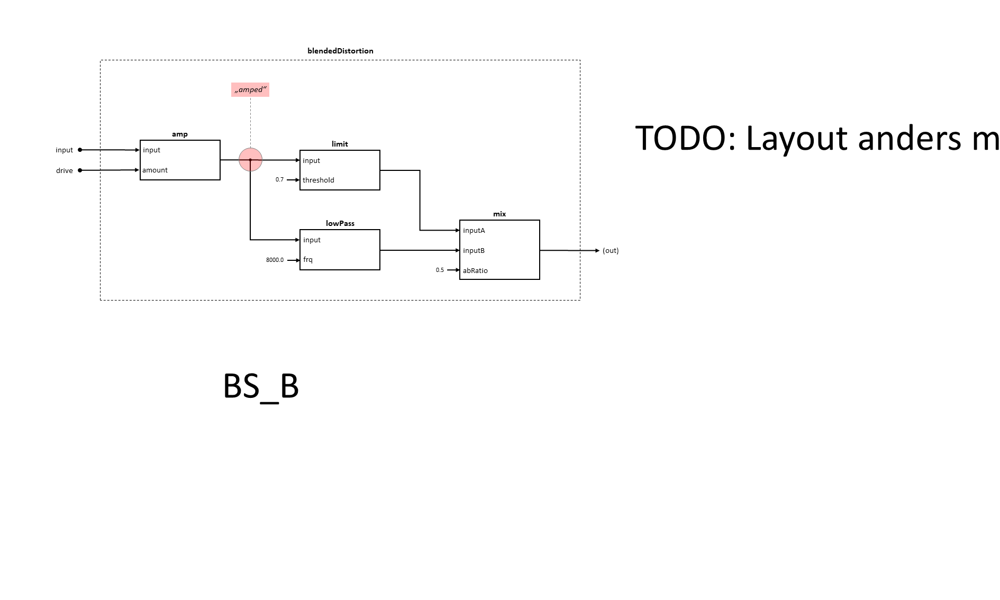

## Composing Stateful Objects

As the name already implies, we are first going to use an approach that is called "Object Oriented Programming". If you don't know what that is, read this:

<excurs data-name="OOP">

"Object oriented programming (OOP) is the thing with classes."

IMHO, that's not true (at least, it's not the key point). It's true that many object oriented programming languages have a class based type system - but that's not the essence of OOP. Another definition of what OOP might be is when 3 things occure together:

* References: Data is held in objects that have a referential identity (not a value-based identity).
* Mutability: Object values can change over time, while it's identity remains (objects are mutable).
* Encapsulation: Data is "protected" by behavior (methods) to help ensure consistency during runtime (encapsulation of local state).

These three characteristics can be seen as features, but at the same time, one has to deal with their consequences, and this has significant impact on how code is written and used.

</excurs>

The upcoming OOP-samples use non-class techniques with functions as objects and closures that capture mutable values. The approach is still object-oriented by the definition from above and it could be easily transformed into code with classes, leading to the same insights. But no matter if you use class-based or non-class-based OOP approach, they differ fundamentally from a pure functional approach where we have no effects (no mutation) and only values (no references).

### "Low Pass" and "Fade In" in OOP

#### Implementation

Here is our implementation of the low pass in F# with OOP techniques:

```fsharp
let lowPassCtor() =
    let mutable lastOut = 0.0
    fun timeConstant input ->
        let diff = lastOut - input
        lastOut <- lastOut - diff * timeConstant
        lastOut
```

What we have here:

* The `lowPassCtor` is a factory function that evaluates to another function.
* This resulting function can be evaluated giving a timeConstant parameter and an input value (it is again a function of `float -> float` after applying all parameters exceept input).
* It captures a mutable `lastOut` value, that is initialized once when the `lowPassCtor` factory is called. That value changes each time the resulting function is evaluated.

The same is for `fadeIn`:

```fsharp
let fadeInCtor() =
    let mutable lastValue = 0.0
    fun stepSize input ->
        let result = input * lastValue
        lastValue <- min (lastValue + stepSize) 1.0
        result
```

#### Usage

In the last chapter, we have already seen how we _would like_ to use the low pass filter: Like a pure function. Here is again how:

```fsharp
// that compiles, but doesn't work.    
let blendedDistortion drive input =
    let amped = input |> amp drive
    let hardLimited = amped |> limit 0.7
    let softLimited = amped |> (lowPassCtor()) 0.2      // we would like to use lowPassCtor
    let mixed = mix 0.5 hardLimited softLimited
    let fadedIn = mixed |> (fadeInCtor()) 0.1           // we would like to use fadeInCtor
    let gained = amp 0.5 fadedIn
    gained
```

But this won't work anymore. We cannot just insert "lowPassCtor" in a pure computation. But why not - the compiler allows that? This true, but the `blendedDistortion` function itself is pure: When it gets evaluated multiple times, it would always create a "new" lowPass by calling the lowPassCtor function, with lowPass's "mutable lastOut" field set to 0.0: It would never calculate anything useful.

<!-- Solving this issue is basically easy, but: TODO: Usually, you don't deal with a single stateful block. Instead, you have a lot of them. And it's a burden to the user managing all these that: He needs to create these instance up front, remove them in case he doesn't need them anymore, bind these function pointers (=references) to identifiers that is again captured in a closure, so that he can finally use them in the actual code he want to write. Anyway, we do it for now: We change our blendedDistortion processing function to a factory function (analog to the lowPassCtor): -->

This issue can be solved by creating lowPass and fadeIn instances up front, and capture that reference in a closure. Doing so, we have to change our blendedDistortion processing function to a factory function (analog to the lowPassCtor):

```fsharp
let blendedDistortionCtor() =

    // create and hold references to stateful objects
    let lowPassInstance = lowPassCtor()
    let fadeInInstance = fadeInCtor()

    fun drive input ->
        let amped = input |> amp drive
        let hardLimited = amped |> limit 0.7
        let softLimited = amped |> lowPassInstance = 0.2
        let mixed = mix 0.5 hardLimited softLimited
        let fadedIn = mixed |> fadeInInstance 0.1
        let gained = amp 0.5 fadedIn
        gained
```

That works! But it's a burden for the user: Every time a stateful function is needed, it has to be declared before it can be used inside of the computation, and the instance has to be removed when it is not needed anymore. When authoring more complex effects or synthesizers, this can be a major pain point: The user's focus is modeling a DSP computation, and not instance management. Since instance management is something that has to be done, it draws away attention from the primary goal and interrupts the workflow of the programmer.

So what can be done to abstract instance management?

Looking again at this block diagram:



There is one important thing to notice: Blocks themselves are not explicitly instanciated and then referenced by an identifier in the computation; they just sit in the place where they are used; they are kind of "inlined", even if they are based on their own local state.

So it seems that in contrast to OOP, block diagrams work like this:

<statement>A function with state is not identified by a reference, but by it's position inside of a computation.</statement>

This is also the case when composing pure functions, and this is what we want to achieve:

**Finding a way of treating stateful functions as if they were pure functions!**

How can we do that?

We have to switch the way `references` are defined, from:

> A reference is made up of a unique address in a global address space.

to:

> A reference is made up of
>    * a data structure which is implicitly defined by a computation,
>    * plus a local offset inside that computation.

Reaching this goal means: The user does not have to deal with instance management, because the aspect of local state would simply result from the way a computation is built by the user.
